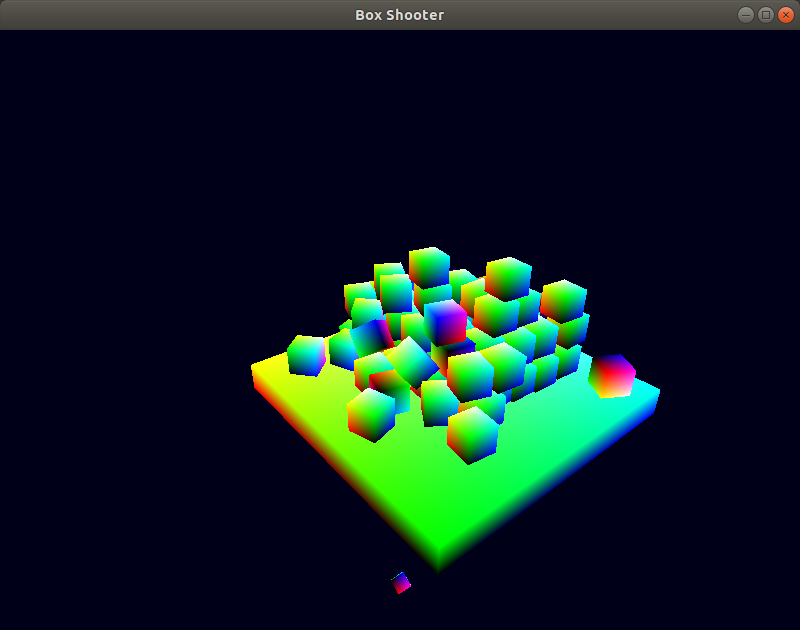

# Box Shooter

A simple game that one can throw box to a pile of boxes to drop some of them. The implementation is using using *OpenGL* and *Bullet Physics*.



## Installing Box Shooter

To install Box Shooter, follow these steps:

```
mkdir build && cd build
```
Using CMake:
```
cmake ..
```
make all:
```
make
```
